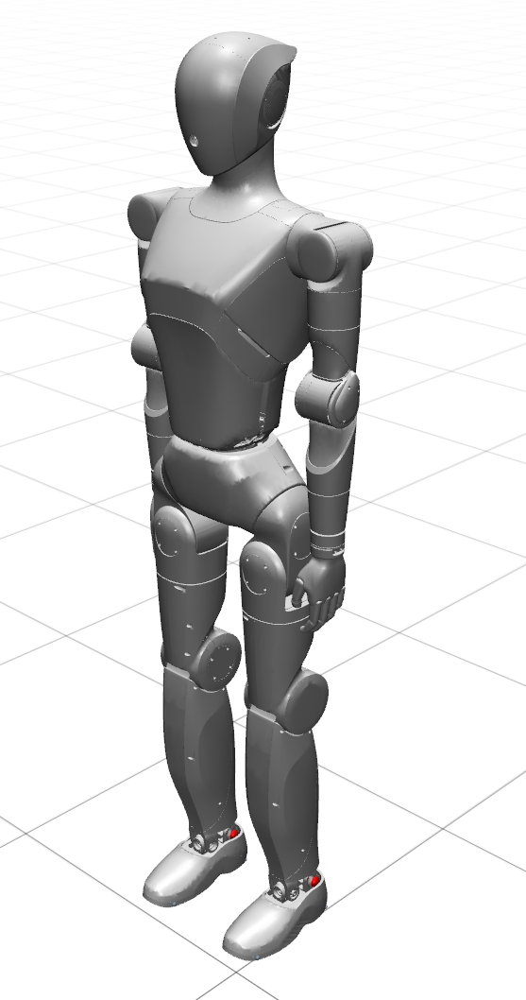

# English | [中文](README_cn.md)

# LimX Luna Robot Description

<p align="center">
  
</p>

URDF, MuJoCo MJCF & USD models for the LimX Dynamics Luna humanoid robot (HU_L04). Provides simulation-ready robot descriptions for ROS, MuJoCo, and NVIDIA Isaac Sim / Isaac Lab.

## Available models

| Model                   | Description                                                              | URDF                   | MuJoCo MJCF           | USD                            |
| ----------------------- | ------------------------------------------------------------------------ | ---------------------- | --------------------- | ------------------------------ |
| **HU_L04**              | Luna humanoid, 27 actuated joints                                        | `urdf/HU_L04_01.urdf`  | `xml/HU_L04_01.xml`   | `usd/HU_L04_01.usd`            |
| **HU_L04 (parallel)**   | Same robot with the ankle and waist parallel linkages modeled as closed loops | —                 | —                     | `usd_parallel/HU_L04_01.usd`   |

> **Note:** Luna's ankles and waist are driven through parallel linkages. URDF cannot represent closed kinematic loops, so the URDF and the matching `usd/` model use a serial approximation in which the ankle and waist joints are driven directly. The MJCF models the linkages with `equality` constraints, and `usd_parallel/` models them as true closed loops for Isaac Lab.

## Directory structure

`HU_L04_description/` contains:

| Directory        | Contents                                                                                      |
| ---------------- | --------------------------------------------------------------------------------------------- |
| `urdf/`          | URDF + SRDF (joint specs: rotor inertia, gear ratio)                                          |
| `xml/`           | MuJoCo MJCF XML: `HU_L04_01.xml` (full dynamics: parallel-linkage constraints, actuators, sensors) and `HU_L04_01_vis.xml` (kinematics only, used for motion retargeting) |
| `usd/`           | NVIDIA USD files, serial approximation consistent with the URDF, + `configuration/` subdirectory |
| `usd_parallel/`  | NVIDIA USD files with the parallel linkages modeled as closed loops, + `configuration/` subdirectory |
| `meshes/`        | STL mesh files                                                                                |
| `world/`         | Simulation world files                                                                        |
| `CMakeLists.txt` | ROS package build file                                                                        |
| `package.xml`    | ROS package manifest                                                                          |

## Quick start

### ROS 1/2

```bash
cd <workspace>/src
git clone https://github.com/limx-luna/luna-description.git
cd ..
catkin_make  # or colcon build
```

### MuJoCo

```bash
python -m mujoco.viewer --mjcf=HU_L04_description/xml/HU_L04_01.xml
```

`HU_L04_01_vis.xml` is a kinematics-only variant (no parallel linkages, actuators or sensors) intended for motion retargeting.

### Isaac Sim / Isaac Lab

Import the USD file from `HU_L04_description/usd/HU_L04_01.usd` via Isaac Sim's reference assembly. Use `HU_L04_description/usd_parallel/HU_L04_01.usd` instead if you need the closed-loop parallel linkages.

## License

Apache License 2.0 — see [LICENSE](LICENSE).

## Related repositories

| Repository                                                         | Description                                          |
| ------------------------------------------------------------------ | ---------------------------------------------------- |
| [luna-beyondmimic](https://github.com/limx-luna/luna-beyondmimic) | BeyondMimic motion tracking training for Luna (Isaac Lab) |

> If you find these models useful, please consider starring this repository.
